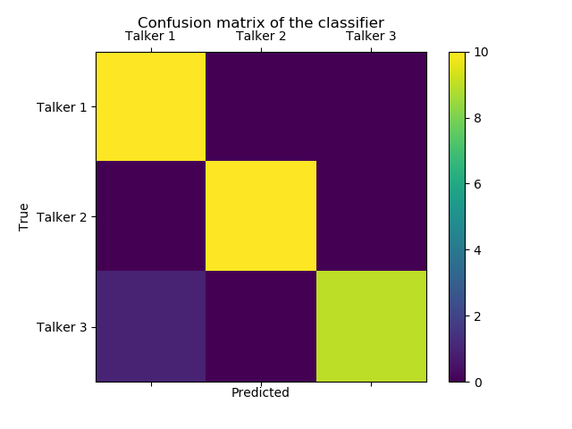

# Voice identifier:
## System For Talker Voice Identification

Voice transmission devices have moved on from simple telephone technology, and many more people are using electronic devices for communication purposes. These devices record and transmit voice signal using [Voice over Internet Protocol (VoIP)](https://en.wikipedia.org/wiki/Voice_over_IP) software, which can deliver much richer voice signal compared to traditional telephone lines that use severely degraded [voiceband](https://en.wikipedia.org/wiki/Voice_frequency) signal. Current abundance of VoIP enabled technologies opens a door for a new user identification method for general purpose authentication based on voice identification. This project aims at developing a robust voice identification system using advanced machine learning techniques. The proposed system can tremendously improve the quality and security of online authentication using voice signal transmitted through VoIP.

 

## Table of Contents

[Summary](#summary)  
[Use Examples](#use-examples)  
[Data and Feature Extraction](#data-and-feature-extraction)  
[Model](#model)  
[Further Development](#further-development)  
[Documentation and Code](#documentation-and-code)  
[Resources](#resources)  
[Bonus Material](#bonus-material)  
[Contact](#contact)  

 

## Summary

The aim of this system is to record tokens of ten randomly chosen words for a user, train an artificial neural network on the tokens, and identify the user from subsequent tokens of the same words. [Multilayer perceptron (MLP)](https://en.wikipedia.org/wiki/Multilayer_perceptron) neural network was used to classify words pronounced by three different talkers. Different tokens of the same words (i.e. the same words pronounced by the same talkers but at a different time) were used to test the network. The system was not only able to correctly identify each token belonging to a given talker, but also clearly differentiated the talkers from each other, thus achieving a great degree of categorization accuracy.

 

## Use Examples

* **Online Learning and Conference:**  
As one of the burgeoning online industries, online learning has great potential. However, a problem is that no one can ensure full and honest participation, creating a key limitation on ensuring that the received learning is of the same quality as that obtained by sitting in a traditional classroom. In addition, online education, especially online learning platforms run by for-profit organizations, suffers from uncontrollable attendance and high dropout rates. Since online learning involves the use of a computer and a learning software platform, a voice identification method via VoIP can be easily integrated in a learning platform. A biometric attendance system could ensure participation and increase the value of online education.

* **Multi-factor authentication (MFA):**  
Currently [two-factor authentication (2FA)](https://en.wikipedia.org/wiki/Multi-factor_authentication) is the most popular strong authentication method out of other MFAs. It largely relies on providing a numeric token in addition to an ID and password. Numeric tokens are either generated remotely and delivered to the user via email or SMS, or generated locally using a disconnected token generator or a smartphone. Some newer systems give an option of smartphone authentication via a direct push notifications. Although secure, these methods suffer from multiple drawbacks, and, therefore, none of these methods are used when individual identification is really important (biometric passport and other legal situations). Voices are unique, just like fingerprints, and ideally suited for individual identification and except a demo of the project [VoCo by Adobe](https://www.youtube.com/watch?v=I3l4XLZ59iw) in 2016, there is currently no known way to forge human voice unlike, for instance, smartphone face ID system, which was [fooled](http://www.bbc.com/news/av/technology-41992610/face-id-iphone-x-hack-demoed-live-with-mask-by-bkav) by Vietnamese researchers almost immoderately after its introduction. In addition, while a disconnected token generator or a smartphone can be lost or stolen, voice cannot.

* **Better Biometric Passports:**  
Standard biometrics that are currently used in biometric IDs include fingerprint recognition, iris recognition, and facial recognition, but notably lack voice identification. Biometric passports can be greatly improved by adding specific, randomly chosen for each person, voice tokens.

* **Other general uses:**  
There are many other applications of this system, from employee check-ins and check-outs to electronic payment systems. This method can be used whenever there is a need to grant access (remotely or locally) to a particular person (e.g. online conference attendee) to a particular system (e.g. online conference) or resource, or identify a person for legal purposes.

 

## Data and Feature Extraction

### Data:

The data consists of audio recordings of 50 monosyllabic words (i.e. short words with only one vowel) pronounced one-by-one by three distinct talkers (one native English speaker, and two non-native English speakers). The words were recorded in a standard lab sound-attenuated room and digitized in mono at a [sampling rate](https://en.wikipedia.org/wiki/Sampling_rate#Audio_sampling) of 44.1 kHz with 16 bit resolution (standard Audio CD quality) using [Praat software](http://www.fon.hum.uva.nl/praat/). This ensures that we retain the full human-audible range of the audio signal, which is 20 Hz to 20 kHz (see [Nyquist-Shannon sampling theorem](https://en.wikipedia.org/wiki/Nyquist_theorem) for details). Each talker recorded two tokens of each word at different times, ranging from one to two weeks apart. This ensured that the tokens come from the same talker, but not pronounced mechanically one after another during the same recording session.

To make the process realistic, only ten tokens were used for each talker. This way we can imitate an actual situation when one has to speak ten words (e.g. numbers from zero to ten) to be used for training of the voice identification system. This way a user won't be overwhelmed with the task of recording many words and training the system. In addition, the choice of the words is not critical in this case, as were are categorizing talkers and not words. However, in telecommunication industry, technicians are using phonetically balanced sentences, so-called [Harvard sentences](https://en.wikipedia.org/wiki/Harvard_sentences), that use each phone of the English language at the same frequency as they appear in everyday speech. Ideally, the system will randomly choose ten words for each user from the pool of monosyllabic or possibly bisyllabic English words. This will enhance security and ensure that only the user knows training words.

### Training and testing datasets:

The training data consists of ten tokens for each talker recorded at time point one and ten tokens of the same words recorded at time point two. Again, the order doesn't matter in this case, as we are trying to have different tokens of the same words from the same talker. In addition, words were randomly chosen for each talker, so each talker has two tokens of the same word, but the words for each talker are not necessarily the same.

### Pre-processing:

As the system is intended to be used with VoIP enabled software, we need to filter and downsample our recordings. VoIP uses [WidebandAudio](https://en.wikipedia.org/wiki/Wideband_audio) that covers sound signal from 50 Hz to 7 kHz or higher, and thus requires sampling frequency of 16 kHz or higher. Praat script (see [Documentation and Code](#Docs) section for details) is used to batch band-pass filter (i.e. remove the signal below 50 Hz and above 7 kHz) and downsample to sampling frequency of 16 kHz all tokens. The process essentially leads to signal compression and represents a dimensionality reduction of data, so there is less data left for further processing. The graph below presents the result of the process for the word CAUSE pronounced by one of the talkers. As can be see on the graph, the entire information above 7 kHz is missing and the signal looks less smooth (compare pixel sizes to see this). Arguably, the gist of the signal (the yellow areas) is still retained. However, we can see that sound "Z" (the last sound in the word CAUSE represented by yellow bends on the right side of the spectrograms) is the most affected one, as it has most of its information between 5 kHz and 15 kHz. In fact, telephone signal is completely void of "Z" and some other sounds as the signal is cut at even lower frequency of 3.4 kHz.

### Feature extraction:

Although sound files are already in the form of numeric vectors, using the vectors of the raw signal directly in a neural network will produce poor results. Instead, we extract meaningful features from the acoustic signal. Again, we can think of this as a dimensionality reduction technique as features will have a smaller number of numeric vectors compared to the original signal. Two python libraries are used for this purpose: Librosa and pyAudioAnalysis (see [Resources](#Resources) section for details). A number of conventional acoustic features are used, which include for example [Mel Frequency Cepstral Coefficients (MFCC)](https://en.wikipedia.org/wiki/Mel-frequency_cepstrum) extracted from a cepstral representation where the frequency bands are on non-linear mel-scale (see [Documentation and Code](#Docs) section for code with details). The final feature matrix includes 261 feature vectors for each sound file. Note that the python libraries used provide some overlapping features, so it is possible to use one or the other, or a smaller combination of features from both.

 

## Model

### Algorithm:

Since we are trying to distinguish speakers from each other, each speaker represents one category with ten examples (i.e. ten tokens). Each sound file can only belong to one speaker, and the problem is a multi-categorization problem. 

Multilayer perceptron (MLP) feedforward artificial neural network algorithm is used to categorize the unique features of each talker's voice. It will allow us to asses the likelihood of a new recording belonging to a given talker. Note that this algorithm will not be appropriate if the task is to identify each word (as opposed to a talker), as it ignores the temporal nature of acoustic signal. A recurrent neural network (RNN) will be more appropriate in the latter case.

### Training and Validation:

Because we are dealing with multiple instances of the same data (i.e. the same words), there is no need to divide the data into training, validation, and testing sets, as is conventionally done for most machine-learning algorithms. We simply train the model on recordings from time point one and test the model on recordings from time point two.

As we have obtained rather clean data with domain expertise, running a model becomes purely a technical matter. For instance, there is no need to use an automated grid-search algorithm to figure out the best hyper-parameters for our model. We can simply use reasonable parameters and be confident that the performance will not disappoint us (this is not always true, but clean, well thought-out data can save a lot of trouble in modelling efforts). 

We will start with defining two hidden layers for the network, a small learning rate (e.g. 0.0001), and a realistic number of epochs or steps (e.g. 500). This will ensure that the network won't take too long to run and will not consume a great deal of resources from a conventional laptop computer. However, for more industrial applications, this parameters can be tailored to a server system at use.

We will use a [sigmoidal activation function](https://en.wikipedia.org/wiki/Sigmoid_function) to introduce nonlinearity between our hidden layers, as we don't want the two layers to represent the same process, and thus be redundantly linear. For the output layer, we will use [softmax activation function](https://en.wikipedia.org/wiki/Softmax_function), which essentially involves normalization. The outputs of softmax can be interpreted as probabilities, which is what we want. This will tell us at each run, if a given file belongs to a given talker.

Next step is to define an error or cost function and its optimization. We start with a well known error function, called [cross-entropy](https://en.wikipedia.org/wiki/Cross_entropy), which essentially measures the difference between our correct categories (e.g. a file belongs to talker 1), or rather the probability distributions thereof, and model predictions for each file. This way, we will know how wrong the model is at every run. The optimization function on the other hand will try to minimize the error. We will start with the [gradient descent (GD) optimizer](https://en.wikipedia.org/wiki/Gradient_descent), which is arguably the simplest optimizer one can use.

With the setup above, the model performs extremely well and achieves accuracy of over 90%. However, we can improve the model and do even better. The first thing to change is the optimizer. We can go with a better optimizer, called [Adam](https://en.wikipedia.org/wiki/Stochastic_gradient_descent#Adam), which is known to overperform the GD optimizer. With the Adam optimizer, we can decrease the number of steps to 100 or below with our data. In addition, we can allow a larger learning rate, of say 0.01.

In fact, the learning rate is another place for improvement. We can add an [exponential decay](https://en.wikipedia.org/wiki/Exponential_decay) function to the learning rate, to lower the learning rate as the training progresses. This will help us to get even smaller error. However, the latter tweak did not bring observable improvements to the model and was left out of the final model. Thus, the final model uses the cross-entropy error function, Adam optimizer, and a fixed learning rate of 0.01. The figure below shows how rapidly the error decreases within the first 50 or so iterations (i.e. steps) of the model.  

Since we are working with only ten examples per category and training and testing data are similar, the model is prone to [overfitting](https://en.wikipedia.org/wiki/Overfitting). This leads to some accuracy fluctuation. For example, accuracy from confusion matrix below is 97%, as the model made only one prediction error (on a non-native talker). However, on another fresh run, the model might make two or even three errors. This suggests that the small data set may have led the model to over-fit the training data, essentially focusing on some features of a few tokens that were not ultimately diagnostic of the category. This may be augmented with more data, but it might be undesirable in this case, since it requires a user to record more tokens. The near perfect performance of the model is rather satisfactory and it is pragmatic not to over-improve it.

 

## Further Development:

Currently, the system does an impressive job. It displays a near perfect accuracy using only modest computing resources and can be even embedded in a small single-board computer system like [Raspberry Pi](https://en.wikipedia.org/wiki/Raspberry_Pi). However, it will be desirable to test robustness of the system using recordings from a different set of talkers.

Another avenue for improvement is to simulate more everyday recording environments by adding noise to the signal and recording remotely via a VoIP enabled software.

A more challenging task it to extend the model to deal better with the [voiceband](https://en.wikipedia.org/wiki/Voice_frequency) signal used in traditional telephone lines. As mentioned earlier, that signal is severely degraded and anything between 300 Hz and 3400 Hz is removed. In fact, voice pitch is absent, as it is below 300 Hz (85 Hz to 180 Hz for adult males, and 165 Hz to 255 Hz for adult females). Humans have a variety of cognitive skills for filling-in the blanks to recognize voices despite the lack of voice pitch, but machine-learning algorithms face a severe poverty of data in this situation. Another level of model sophistication will be needed in order to overcome this challenge.

 

## Documentation and Code

* **README.md** This file.
* **[LICENSE](LICENSE)** This software is covered under [Creative Commons Attribution-NonCommercial-ShareAlike 4.0 International (CC BY-NC-SA 4.0)](https://creativecommons.org/licenses/by-nc-sa/4.0/#)
* **[band_pass_filter_resample.praat](band_pass_filter_resample.praat)** Praat script for sound file batch band-pass filtering and resampling.
* **[voice_identifier.py](voice_identifier.py)** Main python walk through code with full annotations and explanations.
* **[plot_spectrograms.py](plot_spectrograms.py)** A script to plot two spectrograms on one graph.
* **Voice recordings** Although no recordings are provided, as my talkers did not provide permission to publish recordings of their voices, extracted features data can be found in the folder called [data](./data). In addition, python script from above provides a convenient way to load the data and test the system.

 

## Resources

* [Multilayer perceptron (MLP)](https://en.wikipedia.org/wiki/Multilayer_perceptron)
* [Voice over Internet Protocol (VoIP)](https://en.wikipedia.org/wiki/Voice_over_IP)
* [Audio signal sampling rates](https://en.wikipedia.org/wiki/Sampling_rate#Audio_sampling)
* [Praat: doing phonetics by computer](http://www.fon.hum.uva.nl/praat/)
* [Librosa: Python library for audio and music analysis](https://github.com/librosa/librosa)
* [pyAudioAnalysis: Python Audio Analysis Library](https://github.com/tyiannak/pyAudioAnalysis)

 

## Bonus Material

To see the recreation of the neural network procedure used in this project using the [Orange's](https://orange.biolab.si/) visual programming framework as well as python scripting using the Orange python library head to my [other repository](https://github.com/h1ke/voice_identifier_orange).

 

## Contact

Feel free to contact me via [GitHub](https://github.com/h1ke).
